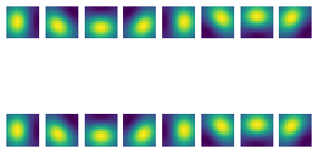

# Papers With Code: Reproducibility Challenge


This file will become your README and also the index of your documentation.

## Install

`pip install your_project_name`

## How to use

Currently only includes an un-tested `GaborLayer` class. 

```python
GL = GaborLayer(filters=2, kernel_size=(15, 15), orientations=8, use_alphas=False)
GL.build([None, 28, 28, 3])

fig, axes = plt.subplots(2, 8)

for n, ax in enumerate(axes.flatten()):
    ax.imshow(GL.kernel[n])
    ax.axis('off')
```




